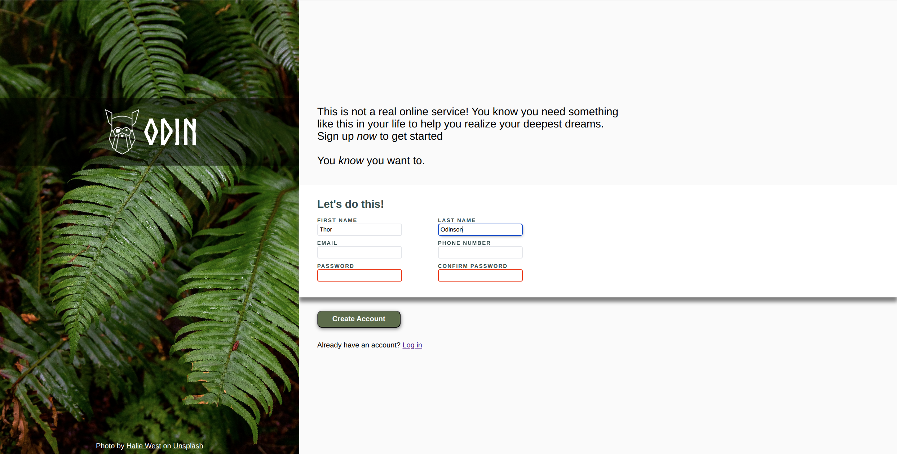

# Project: Sign-up Form

This is my implementation of the
[Project: Sign-up Form](https://www.theodinproject.com/lessons/node-path-intermediate-html-and-css-sign-up-form)
from the Intermediate HTML and CSS Course from The Odin Project.

Checkout the [live preview here](https://peter-mowen.github.io/odin-sign-up-form/).

The goal of this project was to recreate the following design:

The requirements specifically said not to worry about getting this to run on
mobile and not to worry about implementing logic to make sure passwords are the
same. There was no mention on implementing button interaction states, so I left
that for another time.

My submission looks likes this:

